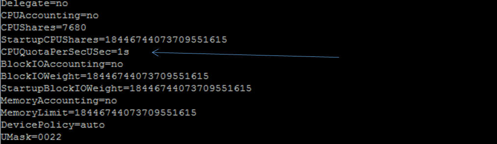

### Examen 2
**Universidad ICESI**  
**Curso:** Sistemas Operativos  
**Nombre:** Alexis Córdoba.  
**Código:** A00232548.  
**Correo:** alexiscord1@gmail.com  

### Descripción
En este documento se muestra en una serie de pasos, la manera en que se crean servicios a partir de Scripts y la manera de controlar algunos recursos de la CPU gracias a CPUQuote y CPUShares. Esto, ayudando a la creación y entendimiento del concepto de asignación de recursos.

### Solución:  
Para la solución del parcial dos, he propuesto que la solución sea a manera de guía comentada cubriendo con evidencias los requerimientos del parcial.

1. En primer lugar creamos los Scripts que usaermos. En este caso son contador.sh y laHora.sh. Estos están ubicados en el directorio /root/parcialDos/Scripts y sus respectivos códigos son:  
  
  

2. Luego usamos los siguientes comandos para hacer de esos Scripts, un servicio por cada uno.

```
# # cd /etc/systemd/system
# vim countDos.service
[Unit]
Description = Give time every two seconds.
[Service]
ExecStart = /root/parcialDos/Scripts/laHora.sh
[Install]
WantedBy = default.target
# systemctl enable countDos.service
```

```
# # cd /etc/systemd/system
# vim countTres.service
[Unit]
Description = Counter increased in 1 every two seconds.
[Service]
ExecStart = /root/parcialDos/Scripts/contador.sh
[Install]
WantedBy = default.target
# systemctl enable countTres.service
# systemctl daemon-reload
# systemctl start countDos.service
# systemctl start countTres.service
``` 

```
# # cd /etc/systemd/system
# vim countTres.service
[Unit]
Description = Counter increased in 1 every two seconds.
[Service]
ExecStart = /root/parcialDos/Scripts/contador.sh
[Install]
WantedBy = default.target
# systemctl enable countTres.service
# systemctl daemon-reload
```  

3. Iniciamos los servicios y revisamos si están activos.  

Iniciamos los servicios.  

```
# systemctl start countDos.service
# systemctl start countTres.service
```  
Para verificar el estado de los servicios usamos los siguientes comandos:

```
# systemctl status countDos.service
# systemctl status countTres.service
```  
Y las salidas deben ser similares a las siguientes:  

  
  
Como vemos ya los dos servicios están en ejecución.  

4. Para asignar el porcentaje indicado usaremos los siguientes comandos:  

```
# systemctl set-property countDos.service CPUQuota=50%
# systemctl set-property countTres.service CPUQuota=50%
```  

Para verificar si los cambios sobre cada servicio fueron hechos correctamente verificamos con:  
```
# systemctl systemctl show countDos.service
# systemctl systemctl show countTres.service
```  
Y debemos obtener unas salidas similares a las siguientes:
Observe el parámetro CPUQuotaPerSecUSec en la primera imagen. Su valor es de "infinity" que viene por defecto cuando se crea el servicio.  
  

Ahora observe el mismo parámetro y notara que ha cambiado su valor a 500ms, siendo el equivalente a 50%:  
  

Tratándose de CPUQuota, el valor que le asignamos como parámetro, marca un límite en cuanto al uso de estos, de tal manera que si cancela uno de los servicios junto con su proceso, el proceso que queda no podrá utilizar los recursos disponibles del primer servicio.  

5. Si queremos que los recursos liberados por un servicio queden disponibles para el otro, debemos usar una combinación entre CPUQuota y CPUShares. Para la demostración procederemos a establecer nuevos valores en la asignación de recursos.  
Para la asignación de recursos con el comando CPUShares usamos los siguientes comandos:  
```
# systemctl systemctl set-property countDos.service CPUShares=7680
# systemctl systemctl set-property countTres.service CPUShares=2560
```  
Los anteriores valores equivalen al 75% y 25% respectivamente para cada servicio. Luego verificamos con el comando:  
```
# systemctl show -p CPUShares countDos.service
# systemctl show -p CPUShares countTres.service
```
Obteniendo unas salidas similares a las siguientes:
  

Cuando este valor no se ha cambiado, tiene por defecto el siguiente:  
  

Luego, con los siguientes comandos, nos aseguramos que una vez cerrado un proceso, el otro puede acceder tranquilamente a los recursos liberados:  

# systemctl set-property countDos.service CPUQuota=100%
# systemctl set-property countTres.service CPUQuota=100%

  

De esta manera interactuan las herramientas CPUQuota y CPUShares.

6. Mientras CPUQuota asigna un límite al uso de la CPU, el valor de CPUShares habla de la reserva de recursos que se le asigna a una servicio (usuario, proceso, etc). Es por eso que un servicio cuyo CPUQuota haya sido establecido en el 40% no podrá usar más de esos recursos de CPU aun cuando haya más de este disponible. Por el contrario CPUShares puede utilizar los recursos liberados por otro servicio al cerrarse siempre y cuando la configuración lo permita así como en el caso anterior que le asignamos por CPUShares ciertos porcentajes a los procesos y por CPUQuota les asignamos un 100%.  
 a. Si nuestras necesidades sobre algún servicio implica restricción de recursos, usaremos CPUQuota.
 b. Si nuestras necesidades sobre algún servicio implica reserva de recursos, usaremos CPUShares.
 c. Si nuestras necesidades sobre algún servicio implican restricción y reserva de recursos pordemos combinarlas. Este último caso nos permite limitar y distribuir de mejor manera los recursos para nuestros servicios.

### Referencias
https://docs.docker.com/engine/admin/resource_constraints/#configure-the-realtime-scheduler
https://www.freedesktop.org/software/systemd/man/systemd.resource-control.html
https://github.com/ICESI/so-processes/tree/master/03_systemd
https://github.com/ICESI/so-commands/tree/master/centos7/06_scripts
https://www.cyberciti.biz/faq/bash-while-loop/
